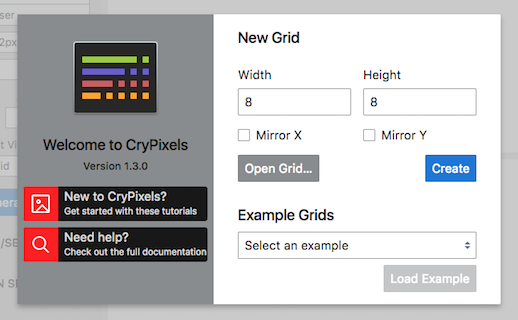
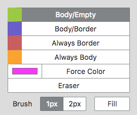
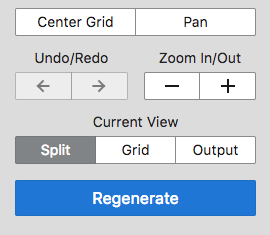
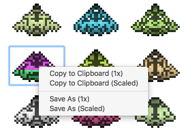
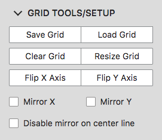
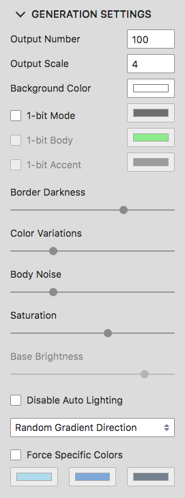
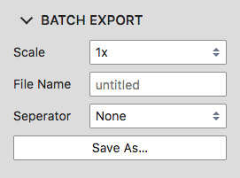
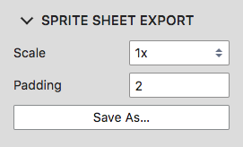

# Introduction

CryPixels lets you procedurally generate hundreds of pixel art sprites for games or any other project, with an easy to use interface.

Here you will find documentation and tutorials to help you get the best out of CryPixels from the very beginning. If you have questions, please check the <a href="../#faq">Frequently Asked Questions</a> on the main site.

## Introduction Video

<iframe width="560" height="350" src="https://www.youtube-nocookie.com/embed/nKS64jCgiQg?rel=0&amp;showinfo=0" frameborder="0" allow="autoplay; encrypted-media" allowfullscreen></iframe>

# Basics

## Create a Grid

In CryPixels, before any sprites can be generated you need to create a generation grid. Upon opening CryPixels you will be greeted with the Welcome Screen as shown below.

Here you can set the width and height of the grid, the default is 8.

You can also select if the grid will be mirrored on the X axis, Y axis or both. If you mirror the grid the outputted sprite will be twice the size in that direction. For example if your grid width is set to 8, and you enable 'Mirror X', the sprite will be 16 wide.

You can change the above settings after you have created a grid from the [Grid Tools/Setup Panel](#grid-toolssetup-panel).

You can now click 'Create', alternatively you can select 'Open Grid...' to load a previously saved generation grid, or select an example grid using the drop down menu, and then clicking 'Load Example'.

## Grid Brushes

CryPixels has 4 different Generation Grid Brushes. Each brush has a specific color so you can easily see how the Generation Grid is populated. There is also a 'Force Color' brush, which will show on the grid in the specific color you have selected, however will have a small white triangle in the top left corner so it's always identifiable.

* **Body/Empty**  
  50% chance body pixel, 50% chance empty pixel  
  _(used for defining general shape)_

* **Body/Border**  
  50% chance body pixel, 50% chance border pixel  
  _(used for defining darker areas)_

* **Always Border**  
  Always a border pixel  
  _(useful when you always require a dark pixel, for example a creatures eyes)_

* **Always Body**  
  Always a body pixel  
  _(useful in larger grids, where you want areas of definition)_
  
* **Force Color**  
  Allows you to define a specific color that the pixel will always be  
  _(when you require a pixel to be a set color, for example red berries on a tree)_
  
* **Eraser**  
  This will erase any grid squares back to blank  
  _(if you want to erase the whole grid use the 'Clear Grid' button)_
  

  
### Brush Size

* **1px**  
  Sets the brush size to 1px
  
* **2px**  
  Sets the brush size to 2px
  
* **Fill**  _v1.3 onwards_  
  Will fill the selected grid square and any adjacent squares of the same type

Setting the brush size will also set the Eraser size.

## Toolbar

The main toolbar is located on the top left of your screen, it includes the [Grid Brushes](#grid-brushes), as well as the following.
  
* **Center Grid**  
  Centers the Generation Grid into the middle of your screen

* **Pan**  
  When selected you can pan the grid by <kbd>Left Click</kbd> and dragging  
  _(used to quickly navigate the grid while zoomed in)_

* **Undo/Redo**  
  Allows you to undo/redo your recent actions on the Generation Grid  
  _(stores 10 most recent actions in history)_
  
* **Zoom In/Out**  
  Allows you to Zoom In and Out of the Generation Grid
  
* **Current View**  
  This sets the active workspace to one of the following:
  
  * **Split View:** top half of the screen shows the Generation Grid View, bottom half shows the Output View
  
  * **Grid View:** shows only the Grid View for working with the Generation Grid
  
  * **Output View:** Shows only the Output View for viewing the generated sprites
    
* **Regenerate**  
  Regenerates sprites into the output view using the settings from the [Generation Settings Panel](#generation-settings-panel)
  

## Export Sprites

You can export individual sprites by <kbd>Right Click</kbd> a sprite in the output view, and selecting one of the following options:

* **Copy to Clipboard (1x)**  
  Copies the selected sprite to the clipboard in original pixel size  
  _(if you have a 10px wide generation grid, it will output a 10px wide sprite regardless of the 'Output Scale')_

* **Copy to Clipboard (Scaled)**  
  Copies the selected sprite to the clipboard using the 'Output Scale'  
  _(if you have a 10px wide generation grid and a 'Output Scale' of 4, it will output a 40px wide sprite)_

* **Save As (1x)**  
  Saves the selected sprite to your chosen directory in original pixel size  
  _(if you have a 10px wide generation grid, it will output a 10px wide sprite regardless of the 'Output Scale')_

* **Save As (Scaled)**  
  Saves the selected sprite to your chosen directory using the 'Output Scale'  
  _(if you have a 10px wide generation grid and a 'Output Scale' of 4, it will output a 40px wide sprite)_

# Grid Tools/Setup Panel

Underneath the main toolbar you can open the 'Grid Tools/Setup' panel, here you will find settings for the generation grid.

* **Save Grid**  
  Saves the current generation grid in .crypix format to your chosen directory 

* **Load Grid**  
  Loads a .crypix generation grid from your local file system  
  
* **Clear Grid**  
  Clears the grid back to being blank  
  _(warning, this action can't be undone)_

* **Resize Grid**  
  Resizes the current generation grid using a selected pivot point  
  _(warning, this action can't be undone)_

* **Flip X Axis**  
  Flips the generation grid horizontally  

* **Flip Y Axis**  
  Flips the generation grid vertically  

* **Mirror X**  
  Mirrors the generation grid horizontally when generating sprites  
  _(if you have a 10px wide generation grid, the generated sprites will be mirrored and now 20px wide before scaling)_

* **Mirror Y**  
  Mirrors the generation grid vertically when generating sprites  
  _(if you have a 10px tall generation grid, the generated sprites will be mirrored and now 20px tall before scaling)_

* **Disable mirror on center line**  
  Disables the center line from mirroring when either 'Mirror X' or 'Mirror Y' is enabled  
  _(if you have a 10px wide generation grid with 'Mirror X' enabled, the generated sprites will be 19px wide with the center line not mirrored)_

# Generation Settings Panel

Underneath the main toolbar you can open the 'Generation Settings' panel, here you will find settings to change how the sprites are generated.

* **Output Number**  
  Sets the amount of sprites generated each time 'Regenerate' is clicked  
  _(value between 10 and 500)_

* **Output Scale**  
  Sets the scale for generated sprites in the 'Output View'  
  _(if you have a 10px wide generation grid and a 'Output Scale' of 4, sprites will be 40px wide in the 'Output View')_

* **Background Color**  
  Sets the 'Output View' background color  
  _(all outputted sprites will have a transparent background unless the below option is checked)_
  
* **Include background color on export**  _v1.3.1 onwards_  
  When enabled the background colour will be included when using all export options  
  _(this includes batch exporting and sprite sheet export)_

* **1-bit Mode**  
  When enabled, sprites will be generated in 1-bit style, using the selected color from the color picker  
  _(good for retro style games)_

* **1-bit Solid Body**  
  When enabled, you can set a body color for 1-bit style sprites using the color picker  
  _(this option is only available when 1-bit mode is enabled)_
  
* **1-bit Accent**  _v1.3 onwards_  
  When enabled, you can set a color which will be used for any darker pixels in the sprites body using the color picker  
  _(this option is only available when 1-bit mode is enabled)_
  
**The below options are only available when 1-bit mode is disabled:**

* **Border Darkness**  
  Sets the darkness of the sprites border pixels  
  _(default is 70, double click slider to reset)_

* **Color Variations**  
  Adjusts how likely each sprite is to have multiple colors  
  _(default is 25, double click slider to reset)_

* **Body Noise**  
  Adjusts the amount of pixel noise in generated sprites  
  _(default is 25, double click slider to reset)_

* **Saturation**  
  Adjusts how saturated the generated sprites colors will be, if set to 0 this will cause grayscale sprites  
  _(default is 60, double click slider to reset)_

* **Base Brightness**  
  Sets the generated sprites color brightness, 1 being the brightest  
  _(this option is only available when 'Disable Auto Lighting' is enabled. Default is 0.9, double click slider to reset)_

* **Disable Auto Lighting**  
  If enabled the the 'Base Brightness' will be used instead of auto lighting  
  _(auto lighting uses the 'Gradient Direction' to give sprites faux lighting using darker and lighter pixels)_

* **Gradient Direction**  
  When 'Color Variations' are used, the gradient direction sets which way the variation will happen (i.e. vertical causes the colors to change top to bottom)  
  _(this setting defaults to random)_

* **Force Specific Colors**  
  Allows 3 selected colors to be used instead of random colors, if 'Color Variations' is set to '0' then only the first color will be used  
  _(when enabled 'Saturation' and 'Base Brightness' will be disabled as they serve no purpose)_

# Batch Export Panel  

Underneath the main toolbar you can open the 'Batch Export' panel, here you will be able to batch export all generated sprites at one time.

* **Scale**  
  Chose between one of the following options:
  * **1x:** Output sprites in original pixel size  
  _(if you have a 10px wide generation grid, it will output all sprites 10px wide regardless of the 'Output Scale')_
  * **Scaled:** Output sprites using the 'Scaled Size'  
  _(if you have a 10px wide generation grid and a 'Output Scale' of 4, it will output all sprites 40px wide)_

* **File Name**  
  Set the file name for the outputted sprites to use  
  _(each sprite will be named the 'File Name' followed by the sprite number)_

* **Seperator**  
  Set the separator which will appear between the 'File Name' and the sprite number  
  _(choose from one of the dropdown options)_

* **Save As**  
  Saves all the generated sprites to your chosen directory  
  _(the outputted sprites will be saved as a .zip directory so you can't accidentally fill your desktop with 500 sprites!)_

# Sprite Sheet Export Panel

**_v1.3.1 onwards_**

Underneath the main toolbar you can open the 'Sprite Sheet Export' panel, here you will be able to export all generated sprites to a sprite sheet.

* **Scale**  
  Chose between one of the following options:
  * **1x:** Output sprites in original pixel size  
  _(if you have a 10px wide generation grid, it will output all sprites 10px wide regardless of the 'Output Scale')_
  * **Scaled:** Output sprites using the 'Scaled Size'  
  _(if you have a 10px wide generation grid and a 'Output Scale' of 4, it will output all sprites 40px wide)_

* **Padding**  
  Sets the padding in 'px' which will be added between each individual sprite in the sprite sheet  
  _(this is useful to avoid texture bleeding which can happen when using certain renderers such as OpenGl)_

* **Save As**  
  Saves the generated sprite sheet to your chosen directory  

# Shortcut Keys

The shortcuts listed below can also be viewed from inside the app, by clicking the 'Shortcuts' buttons located at the bottom of the toolbar on the left side.

<table>
  <tr>
    <th rowspan="2">Command</th>
    <th colspan="2">Shortcut Key</th>
  </tr>
  <tr>
    <th>Windows</th>
    <th>macOS</th>
  </tr>
  <tr>
    <td>Body/Empty</td>
    <td >Q</td> 
    <td >Q</td> 
  </tr>
  <tr>
    <td>Body/Border</td>
    <td>W</td> 
    <td>W</td> 
  </tr>
  <tr>
    <td>Always Border</td>
    <td>E</td> 
    <td>E</td> 
  </tr>
  <tr>
    <td>Always Body</td>
    <td>R</td> 
    <td>R</td> 
  </tr>
  <tr>
    <td>Force Color</td>
    <td>F</td> 
    <td>F</td> 
  </tr>
  <tr>
    <td>Eraser</td>
    <td>D</td> 
    <td>D</td> 
  </tr>
  <tr>
    <td>Pan Grid</td>
    <td>Space bar</td> 
    <td>Space bar</td> 
  </tr>
  <tr>
    <td>Toggle Brush Size</td>
    <td>S</td> 
    <td>S</td> 
  </tr>
  <tr>
    <td>Zoom In</td>
    <td>Ctrl +</td> 
    <td>Cmd +</td> 
  </tr>
  <tr>
    <td>Zoom Out</td>
    <td>Ctrl -</td> 
    <td>Cmd -</td> 
  </tr>
  <tr>
    <td>Center Grid</td>
    <td>Ctrl 0</td> 
    <td>Cmd 0</td> 
  </tr>
  <tr>
    <td>Split View _v1.3 onwards_</td>
    <td>Ctrl 1</td> 
    <td>Cmd 1</td> 
  </tr>
  <tr>
    <td>Grid View _v1.3 onwards_</td>
    <td>Ctrl 2</td> 
    <td>Cmd 2</td> 
  </tr>
  <tr>
    <td>Output View _v1.3 onwards_</td>
    <td>Ctrl 3</td> 
    <td>Cmd 3</td> 
  </tr>
  <tr>
    <td>Undo</td>
    <td>Ctrl Z</td> 
    <td>Cmd Z</td> 
  </tr>
  <tr>
    <td>Redo</td>
    <td>Ctrl Y</td> 
    <td>Cmd Y</td> 
  </tr>
  <tr>
    <td>Regenerate</td>
    <td>Ctrl R</td> 
    <td>Cmd R</td> 
  </tr>
</table>

# Changelog

### v1.3.1

**Enhancements:**
* Sprite sheet exporter
* Option to include the background color when exporting sprites added to the Generation Settings panel

**Changes:**
* Display wait cursor when regenerating sprites, batch exporting and sprite sheet exporting for better user experience
* Increase the max generation grid size to 64

**Bug Fixes:**
* Fixed .crypix file association on Windows when using Steam Client
* Fixed grid brush incorrectly remaining active when leaving generation grid panel while holding left click

### v1.3.0

**Enhancements:**
* Accent colour feature to 1-bit mode
* Flood-fill brush, works like the paint bucket tool in other programs
* Keyboard shortcuts for the different views 'Split', 'Grid' and 'Output'
* Documentation now accessible from the welcome screen
* New icon to match the logo rebrand

**Changes:**
* Changed MacOS combination shortcut keys from using 'ctrl' to using 'cmd' key for improved compatibility with system shortcut combinations
* Moved the 'Pan' shortcut next to 'Center Grid',  and moved 'Clear Grid' into 'Grid Tools/Setup'
* 'Pan' keyboard shortcut is now hold while using, and returns to previous brush when released

**Bug Fixes:**
* Blank sprites from being outputted when using a sparsely populated generation grid

### v1.2.0

**Enhancements:**
* 'Force Color' brush (similar to always border but with specific set colour)
* 'Disable mirror on center line' in 'Grid tools'

**Changes:**
* .crypix file format to version 1.1
* Demo version is no longer limited to 1-bit mode, all features can be tested except exporting

**Bug Fixes:**
* 'Body/None' brush was labelled wrong in the Shortcuts helper window
* 'Output Number' & 'Output Scale' would use previous value if input still active when using 'Regenerate' keyboard shortcut

### v1.1.1

**Enhancements:**
* Mac download now uses a DMG disk image format, with a shortcut for dragging to Applications folder
* Added a Windows installer option for users not using the itch.io App.
* Windows installer option associates .crypix files with CryPixels.

**Bug Fixes:**
* Fix Windows File Explorer not opening .crypix files when CryPixels is already open
* Fix macOS Finder not opening .crypix files when path contains white spaces

### v1.1.0

**Enhancements:**
* Option when generating sprites to force specific colours, 3 colours can be selected which will be cycled through in order when needed for colour variations
* When right clicking sprites you can now 'Copy to Clipboard' in the context menu with options for 1x or scaled
* Allow Mac users to open .crypix files using Finder or by dragging files to the dock icon
* Allow Windows users to open .crypix files using File Explorer
* Improved welcome screen with additional information

**Bug Fixes:**
* Fix rare bug that causes shortcut keys not to work when using the re-generate shortcut multiple times while a sprite is selected
* Add warning when loading grid from 'grid tools' panel that unsaved data will be lost
* Fix crash when dragging a file onto the apps window using Finder or File Explorer

### v1.0.0

**Enhancements:**
* Add option to set additional body colour when generating 1-bit sprites
* Add Windows and Mac demo with certain limitations.

**Changes:**
* Changed some UI label names to make them more consistent across app.

### v0.4.2

**Enhancements:**
* Add 'Bulk Export' panel
* Add option to export all generated sprites to a .zip file
* Add option to set bulk export file name and separator style between the file name and sprite number
* Add 'Load Example' selector to the start screen so user's don't need to download the separate example-grids file

**Changes:**
* Change 'Reset Software' button in toolbar footer to 'Reload Software'

**Bug Fixes:**
* Fixed input fields resetting if still focused when hovering the generation grid
* Fixed grid brush would paint without mouse-down after outputting sprite using context menu

### v0.4.1

Initial Release
